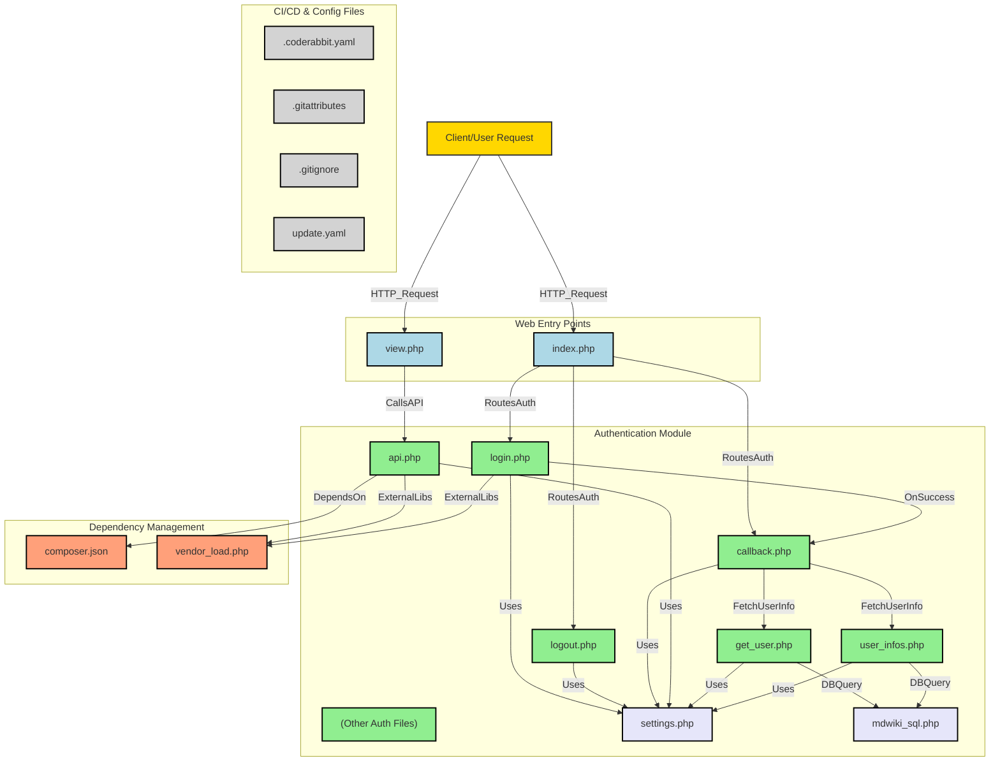

[](https://deepwiki.com/Mdwiki-TD/auth-repo)

# Authentication System

## Overview

This project is an authentication system implemented in PHP. It manages user authentication tasks such as login, logout, callbacks (potentially for OAuth), and user data management.

## System Components

The project consists of three main components:

### 1. Auth Module – Core Authentication Endpoints

This module contains the core authentication logic and API endpoints.

-   **Files:**
    -   `auth/login.php` – Handles user login requests.
    -   `auth/logout.php` – Manages user logout functionality.
    -   `auth/callback.php` – Handles authentication callbacks (e.g., OAuth responses).
    -   `auth/get_user.php`, `auth/user_infos.php` – Fetch user information.
    -   `auth/index.php`, `auth/edit.php` – Provides user-related interactions.
    -   `auth/api.php`, `auth/access_helps.php`, `auth/helps.php`, `auth/send_edit.php` – Additional API endpoints.
    -   `auth/mdwiki_sql.php` – Potential SQL interactions for user authentication.

### 2. Configuration & Dependencies

Manages system configuration and external dependencies.

-   **Files:**
    -   `auth/settings.php` – Contains system-wide configuration settings (e.g., database connections, credentials).
    -   `composer.json` – Defines PHP dependencies managed via Composer.
    -   `vendor_load.php` – Loads external libraries for authentication handling.

### 3. Presentation Layer (User Interface)

Represents the front-end components that interact with the authentication system.

-   **Files:**
    -   `index.php` – Main entry point for user interactions.
    -   `view.php` – User-facing views for authentication and related actions.

## System Design

The authentication system follows a modular architecture:

-   **Client Interaction:** Users interact via `index.php` and `view.php`, which send authentication requests to the Auth Module.
-   **Authentication Workflow:**
    -   `login.php` initiates authentication.
    -   `callback.php` processes third-party authentication responses.
    -   `get_user.php` and `user_infos.php` retrieve user data.
    -   `logout.php` handles session termination.
-   **Configuration & Dependencies:** `settings.php` supplies settings, while `composer.json` and `vendor_load.php` manage dependencies.
-   **(Optional) Database Integration:** If user data persistence is needed, `mdwiki_sql.php` may facilitate database interactions.

## Data Flow

1. **User Requests:**
    - Client (browser) requests authentication via `index.php` or `view.php`.
    - Requests are forwarded to authentication endpoints in `auth/`.
2. **Authentication Processing:**
    - Login and authentication responses are handled in `login.php` and `callback.php`.
    - User data retrieval occurs via `get_user.php` and `user_infos.php`.
3. **Logout & Session Management:**
    - `logout.php` manages user logout operations.
4. **Configuration & Initialization:**
    - `settings.php` provides necessary configurations.
    - Dependencies are loaded via `composer.json` and `vendor_load.php`.
5. **Optional Database Interactions:**
    - `mdwiki_sql.php` may be used for authentication-related SQL operations.

## Architectural Considerations

-   **Separation of Concerns:** The system divides logic into authentication processing, user interactions, and configuration.
-   **Modular Design:** Each PHP file serves a distinct function, allowing flexibility and maintainability.
-   **Dependency Management:** Uses Composer for handling external dependencies.

## Installation & Setup

1. Clone the repository:
    ```bash
    git clone <repository_url>
    ```
2. Install dependencies:
    ```bash
    composer install
    ```
3. Configure the system:
    - Edit `auth/settings.php` with appropriate settings.
4. Deploy the application on a PHP-compatible web server.

## Usage

-   API endpoints in `auth/` can be used for authentication and user data management.

## License

## Diagram


