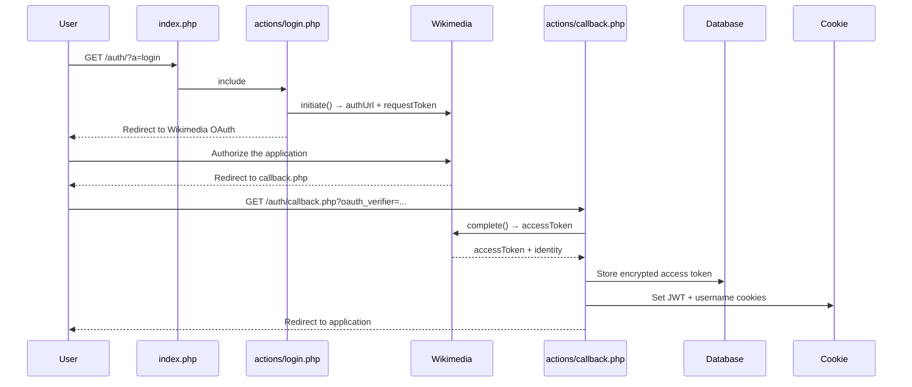

[](https://deepwiki.com/Mdwiki-TD/auth-repo)

# MediaWiki OAuth Authentication System

## Project Overview

A standalone PHP-based OAuth 1.0 authentication service for MediaWiki-powered sites. It handles the full OAuth lifecycle — initiating login via Wikimedia's OAuth endpoint, exchanging tokens on callback, storing encrypted access tokens in MySQL, issuing JWT session tokens, and managing encrypted cookies. Designed to serve as a shared authentication layer for multiple tools under the `mdwiki.toolforge.org` domain.

### Main Features

-   **OAuth 1.0a flow** with Wikimedia (meta.wikimedia.org) via `mediawiki/oauthclient`
-   **JWT-based session tokens** (HS256, 1-hour expiry) via `firebase/php-jwt`
-   **Symmetric encryption** of cookies and stored tokens via `defuse/php-encryption`
-   **Persistent token storage** in MySQL with encrypted access keys/secrets
-   **Environment-aware configuration** — separate behavior for development, production, and testing
-   **Local development bypass** — skips OAuth flow on localhost for faster iteration
-   **State preservation** — passes `cat`, `code`, `camp`, and `return_to` parameters through the OAuth callback
-   **JSON API endpoint** (`get_user.php`) for external tools to query the authenticated user

### Frameworks & Technologies

| Technology                   | Purpose                                              |
| ---------------------------- | ---------------------------------------------------- |
| PHP 8.0+                     | Runtime (uses `match`, named arguments, union types) |
| `mediawiki/oauthclient` ^1.2 | OAuth 1.0a client for MediaWiki                      |
| `firebase/php-jwt` 7.0.0     | JWT creation and verification                        |
| `defuse/php-encryption` ^2.4 | Symmetric encryption for cookies and tokens          |
| PDO / MySQL                  | Token and user storage                               |
| PHPUnit 10.x                 | Unit testing                                         |
| PHPStan level 5              | Static analysis                                      |
| GitHub Actions               | CI/CD (tests + deployment via SSH)                   |

### PHP Version Requirement

PHP 8.0 or higher (strict types used throughout; `declare(strict_types=1)` in all classes and tests).

---

## Project Structure

```
auth_repo/
├── src/                          # Application source code
│   ├── index.php                 # Entry point — routes to view or action
│   ├── include_all.php           # Bootstrap — loads vendor, DB, settings, helpers
│   ├── vendor_load.php           # Composer autoloader resolution
│   ├── view.php                  # HTML UI — shows login/logout status
│   ├── login.php                 # Login entry — delegates to actions/login.php
│   ├── callback.php              # Callback entry — delegates to actions/callback.php
│   ├── logout.php                # Logout entry — delegates to actions/logout.php
│   ├── get_user.php              # JSON API — returns authenticated username
│   ├── actions/                  # Action handlers (business logic)
│   │   ├── login.php             # Initiates OAuth flow, redirects to Wikimedia
│   │   ├── callback.php          # Completes OAuth, stores tokens, sets cookies
│   │   └── logout.php            # Clears session and cookies
│   ├── oauth/                    # Core OAuth module (namespaced classes/functions)
│   │   ├── settings.php          # Singleton config — OAuth\Settings\Settings
│   │   ├── mdwiki_sql.php        # Database layer — OAuth\MdwikiSql\Database
│   │   ├── access_helps.php      # Token CRUD — OAuth\AccessHelps\*
│   │   ├── helps.php             # Encryption + cookie helpers — OAuth\Helps\*
│   │   ├── jwt_config.php        # JWT operations — OAuth\JWT\*
│   │   ├── user_infos.php        # Session/cookie-based user identification
│   │   ├── utils.php             # State building, alerts, return-to validation
│   │   └── index.php             # Empty (placeholder)
│   └── dev/                      # Development-only utilities
│       ├── dev_login.php         # Bypasses OAuth on localhost
│       └── load_env.php          # Loads .env vars via putenv() for local dev
├── tests/                        # PHPUnit test suite
│   ├── bootstrap.php             # Test environment setup (keys, DB, server vars)
│   ├── HelpsTest.php             # Tests for encryption/decryption helpers
│   └── JwtConfigTest.php         # Tests for JWT create/verify
├── auths_tests/                  # Manual browser-based test scripts (legacy)
├── docs/                         # Documentation
│   └── new-structure-oc.md       # Proposed refactoring plan
├── .github/workflows/
│   ├── update.yaml               # Deploy to Toolforge via SSH on push to main
│   ├── phpstan.yaml              # Static analysis CI
│   └── phpunit.yaml              # Test suite CI
├── composer.json                 # Dependencies and scripts
├── phpunit.xml                   # PHPUnit configuration
├── phpstan.neon                  # PHPStan configuration (level 5)
├── .env.example                  # Environment variable template
├── CLAUDE.md                     # AI assistant context
├── refactor.md                   # Technical debt analysis
└── STATIC_ANALYSIS.md            # PHPStan analysis results
```

### Architecture Layers

| Layer             | Files                                                                  | Responsibility                                 |
| ----------------- | ---------------------------------------------------------------------- | ---------------------------------------------- |
| **Entry Points**  | `index.php`, `login.php`, `callback.php`, `logout.php`, `get_user.php` | HTTP routing and delegation                    |
| **Actions**       | `src/actions/*.php`                                                    | Business logic for each OAuth step             |
| **Core Module**   | `src/oauth/*.php`                                                      | Namespaced utilities (DB, crypto, JWT, config) |
| **Configuration** | `settings.php`, `load_env.php`                                         | Environment-driven settings singleton          |
| **Presentation**  | `view.php`                                                             | Minimal HTML UI with Bootstrap cards           |

---

---

## End points

| Endpoint                               | Method | Description                                                                     |
| -------------------------------------- | ------ | ------------------------------------------------------------------------------- |
| `/auth/` or `/auth/index.php`          | GET    | Auth status page — shows login link or authenticated username with logout       |
| `/auth/login.php` or `/?a=login`       | GET    | Initiate OAuth login — redirects to MediaWiki authorization page                |
| `/auth/callback.php` or `/?a=callback` | GET    | OAuth callback handler — completes auth, stores tokens, sets cookies, redirects |
| `/auth/logout.php` or `/?a=logout`     | GET    | Destroy session and clear cookies, then redirect                                |
| `/auth/get_user.php` or `/?a=get_user` | GET    | JSON API — returns `{"username": "..."}`                                        |

All endpoints use GET only. Direct file paths and the `?a=` router are interchangeable for the same endpoint.

---

## Architecture & Code Quality Review

### Code Organization

The project uses a **function-based architecture with namespaced modules** rather than a class-based MVC pattern. Each file in `src/oauth/` exposes namespaced functions (e.g., `OAuth\Helps\encode_value()`) grouped by responsibility. The `src/actions/` directory contains the procedural business logic for each endpoint.

### Design Patterns

| Pattern            | Usage                                                         | Quality                                                       |
| ------------------ | ------------------------------------------------------------- | ------------------------------------------------------------- |
| **Singleton**      | `Settings::getInstance()`                                     | Well-implemented with `__clone()` and `__wakeup()` protection |
| **Factory Method** | `Database` class instantiation in wrapper functions           | Functional but creates new connections per call               |
| **Facade**         | `execute_query()` / `fetch_query()` wrap the `Database` class | Simplifies caller API but hides connection lifecycle          |

### SOLID Principles Compliance

| Principle                     | Assessment                                                                                                                                     |
| ----------------------------- | ---------------------------------------------------------------------------------------------------------------------------------------------- |
| **S** (Single Responsibility) | Mostly adhered — each file has a focused purpose. `user_infos.php` mixes session setup, cookie validation, DB lookup, and constant definition. |
| **O** (Open/Closed)           | Not applicable — no inheritance or extension points needed for this scope.                                                                     |
| **L** (Liskov Substitution)   | N/A — no class hierarchies.                                                                                                                    |
| **I** (Interface Segregation) | N/A — no interfaces defined.                                                                                                                   |
| **D** (Dependency Inversion)  | Partially met — `Settings` singleton is accessed directly rather than injected, making testing harder.                                         |

### Maintainability

-   **Positive**: Clear file naming, consistent namespace convention, good PHPDoc on `Settings` class.
-   **Negative**: Heavy use of `include_once` chains; no autoloading for application code (only vendor). Functions are defined at file scope rather than in classes, limiting testability.

### Readability

-   Code is generally readable with descriptive function names.
-   Inconsistent formatting: mixed use of semicolons after closing braces (`};`), inconsistent brace placement.
-   PHPDoc coverage is sparse — only `Settings`, `login.php`'s `showErrorAndExit()`, and `login.php`'s `add_callback_state()` have proper docblocks.

### Scalability

-   Each database query creates and destroys a `Database` instance — no connection pooling or reuse within a request.
-   Cookie-based session with 2-year expiry is long; no refresh token mechanism.
-   The system is designed for a single-tool deployment; sharing across tools requires all to trust the same cookie domain.

---

## Strengths

1. **Strong encryption approach** — Uses `defuse/php-encryption` (industry-standard symmetric encryption) for both cookies and stored tokens. Keys are loaded from environment variables, never hardcoded in production.

2. **Well-structured Settings singleton** — `OAuth\Settings\Settings` is properly immutable (read-only via `__set()` override), environment-aware, and validates required keys in production.

3. **OAuth flow error handling** — Both `login.php` and `callback.php` wrap every step in try/catch with user-friendly error messages and server-side logging. This is exemplary error handling for an OAuth integration.

4. **Environment-aware behavior** — The system cleanly separates development/production/testing modes. Local development bypass (`dev_login.php`) avoids the OAuth round-trip during development.

5. **State parameter preservation** — The `cat`, `code`, `camp`, and `return_to` parameters are properly threaded through the OAuth flow via session and URL parameters.

6. **Return-to validation** — `create_return_to()` validates the referer against an allowlist of domains and rejects `/auth/` paths, preventing open redirect vulnerabilities.

7. **Parameterized SQL queries** — All database queries use PDO prepared statements with parameter binding, eliminating SQL injection risk.

8. **Test infrastructure** — PHPUnit 10 with proper bootstrap, PHPStan at level 5, and GitHub Actions CI pipeline.

---

## Weaknesses

1. **New database connection per query** — `execute_query()` and `fetch_query()` instantiate a new `Database` object (and thus a new PDO connection) on every call. This is wasteful when multiple queries happen in a single request (e.g., callback stores tokens + adds user).

2. **Duplicated `showErrorAndExit()` function** — The function is defined identically in both `src/actions/login.php` and `src/actions/callback.php`. It should be in a shared utility file.

3. **Inconsistent error output in callback.php** — `showErrorAndExit()` in `callback.php` does NOT escape HTML in the message (lines 39-44 output raw `$message`), while `login.php`'s version does use `htmlspecialchars()`. This is a potential XSS vector.

4. **Global state via `define()`** — `user_infos.php` uses `define('global_username', $username)` to export the username as a global constant. This is fragile, prevents testing, and pollutes the global namespace.

5. **`include_once` chain architecture** — The entire application is wired together via `include_once` statements. No autoloading for application code means file load order matters and errors are hard to trace.

6. **Mixed `$_GET` parameter usage** — `index.php` reads `$_GET['a']` for routing but also checks `$_GET['test']` for error display. The `?test=1` parameter enables `display_errors` in production code paths.

7. **`FILTER_SANITIZE_STRING` is deprecated** — `utils.php:14` uses `FILTER_SANITIZE_STRING` which was deprecated in PHP 8.1 and removed in PHP 8.2.

8. **Cookie `SameSite` not set explicitly** — `add_to_cookies()` in `helps.php` does not set the `samesite` attribute, relying on browser defaults. Only `logout.php` explicitly sets `'samesite' => 'Lax'`.

9. **Hardcoded redirect target** — `callback.php:143` and `logout.php:30` hardcode `/Translation_Dashboard/index.php` as the default redirect, coupling this auth system to a specific application.

10. **Unused `$table_name` parameter** — Both `execute_query()` and `fetch_query()` accept a `$table_name` parameter that is never used.

---

## Critical Issues

### 1. XSS Vulnerability in `callback.php` (HIGH)

```php
// src/actions/callback.php:39-44
echo "<div style='border:1px solid red; ...'>";
echo $message;  // <-- NOT ESCAPED
```

The `showErrorAndExit()` function in `callback.php` outputs `$message` directly without `htmlspecialchars()`. If an error message ever contains user-controlled data, this is a reflected XSS vulnerability. The same function in `login.php` correctly escapes its output.

### 2. Test Mode Enables Error Display in Production (MEDIUM)

```php
// src/index.php:2-6
if (isset($_REQUEST['test'])) {
    ini_set('display_errors', 1);
    ini_set('display_startup_errors', 1);
    error_reporting(E_ALL);
};
```

Anyone can append `?test=1` to any URL and enable full error display, potentially leaking stack traces, database credentials, and file paths in production.

### 3. Hardcoded Development Credentials (MEDIUM)

```php
// src/dev/load_env.php:10-11
putenv('TOOL_TOOLSDB_USER=root');
putenv('TOOL_TOOLSDB_PASSWORD=root11');
```

While `.gitignore` excludes `/src/dev`, these credentials are committed to the repository. If the dev directory is accidentally deployed, real database credentials are exposed.

### 4. Open Redirect Potential in `callback.php` (LOW-MEDIUM)

```php
// src/actions/callback.php:147-148
if ((strpos($return_to, '/auth/') !== false) || (strpos($return_to, $server_url) === false)) {
    $return_to = "";
}
```

The validation checks if `$return_to` _contains_ the server URL (via `strpos`), not if it _starts with_ it. A URL like `https://evil.com/https://mdwiki.toolforge.org/...` would pass this check.

### 5. SQL Error Messages Exposed to Users (LOW)

```php
// src/oauth/mdwiki_sql.php:111
echo "sql error:" . $e->getMessage() . "<br>" . $sql_query;
```

Database error messages and raw SQL queries are echoed directly to the user, leaking schema information and potentially aiding SQL injection attacks.

---

## Areas That Need Attention

### Missing Validation

-   No CSRF protection on the login initiation endpoint
-   No rate limiting on OAuth callback or login endpoints
-   No input length validation on username values before database storage
-   `$_GET['return_to']` in callback.php is validated but the validation logic has edge cases

### Missing Tests

-   No tests for `access_helps.php` (token storage/retrieval)
-   No tests for `mdwiki_sql.php` (database operations)
-   No tests for `user_infos.php` (session management)
-   No tests for `utils.php` (state building, return-to validation)
-   No integration tests for the full OAuth flow
-   No tests for `actions/login.php`, `actions/callback.php`, or `actions/logout.php`

### Outdated Packages

-   `firebase/php-jwt` is pinned to `7.0.0` — consider using `^7.0` to receive patch updates
-   `FILTER_SANITIZE_STRING` will break on PHP 8.2+

### Missing Environment Configuration

-   No `.env` file committed (correct for security), but no documentation on how to generate Defuse encryption keys
-   Missing `APP_ENV` in `.env.example`

### Error Handling Issues

-   `Database::__destruct()` sets `$this->db = null` but PDO already handles connection cleanup
-   Several catch blocks silently return empty strings/arrays without logging (e.g., `helps.php:27-28`)

### Logging/Monitoring

-   No structured logging — all errors go to PHP's `error_log()` with free-form strings
-   No request ID or correlation ID for tracing authentication flows
-   No metrics or health check endpoint

### Deployment Concerns

-   The `.gitignore` excludes `/src/dev` but the directory exists in the repo — it may be deployed if the deployment script copies the entire repo
-   The deploy workflow (`update.yaml`) runs a shell script (`shs/update_auth.sh`) whose contents are not in this repo

---

## Improvement Plan

### Quick Fixes (1-2 hours)

1. **Fix XSS in `callback.php`** — Add `htmlspecialchars()` to `showErrorAndExit()` output (match `login.php`'s implementation)
2. **Remove `?test=1` error display** — Either remove entirely or gate behind `APP_ENV === 'development'`
3. **Add `SameSite` to cookies** — Add `'samesite' => 'Lax'` to `add_to_cookies()` in `helps.php`
4. **Replace `FILTER_SANITIZE_STRING`** — Use `FILTER_SANITIZE_FULL_SPECIAL_CHARS` or `htmlspecialchars()` in `utils.php`
5. **Remove unused `$table_name` parameter** — Clean up `execute_query()` and `fetch_query()` signatures
6. **Fix SQL error echo** — Replace `echo "sql error:..."` with `error_log()` in `mdwiki_sql.php`

### Medium-Term Improvements (1-2 weeks)

1. **Extract `showErrorAndExit()` to shared utility** — Move to `oauth/utils.php` or a new `oauth/error.php`
2. **Implement database connection reuse** — Use a static/shared `Database` instance or pass PDO as dependency
3. **Add Composer autoloading for app code** — Register `OAuth\*` namespaces in `composer.json` PSR-4 autoload
4. **Replace `define('global_username')` with proper dependency** — Return username from a function instead of polluting global constants
5. **Improve `return_to` validation** — Use `str_starts_with()` instead of `strpos()` for prefix checking
6. **Add CSRF token validation** to login initiation
7. **Add tests for `access_helps.php`** and `utils.php`

### Long-Term Refactoring (1-3 months)

1. **Introduce PSR-7/PSR-15 HTTP layer** — Replace raw `header()` calls and `echo` output with proper request/response objects
2. **Adopt PSR-11 container** — Replace `Settings::getInstance()` with dependency injection
3. **Add refresh token mechanism** — Implement JWT refresh flow instead of relying on 2-year cookies
4. **Create a proper router** — Replace the `$_GET['a']` dispatch in `index.php` with a lightweight router
5. **Add structured logging** — Use PSR-3 logger (e.g., Monolog) with request correlation IDs
6. **Separate the auth service from specific app redirects** — Make redirect targets configurable rather than hardcoding `/Translation_Dashboard/index.php`

### Security Hardening

1. Add `Content-Security-Policy` headers to HTML responses
2. Implement rate limiting on OAuth endpoints
3. Add `httponly` and `secure` flags explicitly on all cookies (already done in most places)
4. Rotate encryption keys periodically — document key rotation procedure
5. Validate JWT `iss` claim during verification (currently only checks signature and expiry)
6. Add audit logging for authentication events (login, logout, token refresh)

---

## Comprehensive Review

| Category                 | Score        | Notes                                                                                        |
| ------------------------ | ------------ | -------------------------------------------------------------------------------------------- |
| **Overall Rating**       | **6.5/10**   | Functional and well-intentioned but has security gaps and architectural debt                 |
| **Production Readiness** | **6/10**     | Works in production but the XSS in callback.php and `?test=1` flag need fixing first         |
| **Security Score**       | **6/10**     | Good encryption choices, parameterized SQL, but XSS vector, error exposure, and missing CSRF |
| **Technical Debt**       | **Moderate** | Duplicated code, global state, no autoloading, hardcoded redirects                           |
| **Maintainability**      | **6/10**     | Clear file structure but include-chain architecture and lack of tests make changes risky     |
| **Risk Assessment**      | **Medium**   | The XSS and error display issues are exploitable; the open redirect edge case is low-risk    |

---

## Setup & Usage

### Installation

```bash
# Clone the repository
git clone <repository_url>
cd auth_repo

# Install PHP dependencies
composer install
```

### Environment Setup

Copy the example environment file and fill in your values:

```bash
cp .env.example .env
```

### Example `.env` Configuration

```env
# Application environment: development | production | testing
APP_ENV=development

# Database (Toolforge or local MySQL)
DB_HOST_TOOLS=localhost:3306
DB_NAME=your_database_name
TOOL_TOOLSDB_USER=your_db_user
TOOL_TOOLSDB_PASSWORD=your_db_password

# Wikimedia OAuth credentials (register at meta.wikimedia.org/wiki/Special:OAuthConsumerRegistration)
CONSUMER_KEY=your_consumer_key
CONSUMER_SECRET=your_consumer_secret

# Generate Defuse encryption keys via:
#   php -r "require 'vendor/autoload.php'; echo \Defuse\Crypto\Key::createNewRandomKey()->saveToAsciiSafeString();"
COOKIE_KEY=def00000...
DECRYPT_KEY=def00000...

# JWT signing secret (random alphanumeric string, 32+ characters)
JWT_KEY=your_random_jwt_secret_here
```

### Database Setup

Create the required tables in your MySQL database:

```sql
CREATE TABLE IF NOT EXISTS access_keys (
    id INT AUTO_INCREMENT PRIMARY KEY,
    user_name VARCHAR(255) NOT NULL,
    user_name_hash VARCHAR(64) NOT NULL,
    access_key TEXT NOT NULL,
    access_secret TEXT NOT NULL,
    created_at TIMESTAMP DEFAULT CURRENT_TIMESTAMP,
    updated_at TIMESTAMP DEFAULT CURRENT_TIMESTAMP ON UPDATE CURRENT_TIMESTAMP,
    UNIQUE KEY unique_user (user_name),
    UNIQUE KEY unique_hash (user_name_hash)
);

CREATE TABLE IF NOT EXISTS users (
    id INT AUTO_INCREMENT PRIMARY KEY,
    username VARCHAR(255) NOT NULL UNIQUE,
    created_at TIMESTAMP DEFAULT CURRENT_TIMESTAMP
);
```

### Local Development

1. Start a local MySQL server and import the schema above.
2. Configure `.env` with `APP_ENV=development` and local DB credentials.
3. Start the PHP built-in server:

```bash
php -S localhost:8000 -t src/
```

4. Navigate to `http://localhost:8000/` — on localhost, the OAuth flow is bypassed and you're automatically logged in as `Mr. Ibrahem`.

### Running Tests

```bash
# Run PHPUnit test suite
composer test

# Or individually:
vendor/bin/phpunit tests --testdox --colors=always

# Run static analysis
vendor/bin/phpstan analyse
```

### Deployment

Pushing to the `main` branch triggers the GitHub Actions workflow (`.github/workflows/update.yaml`), which SSHes into the Toolforge server and runs the deployment script. Ensure the following secrets are configured in your GitHub repository:

-   `HOST` — Toolforge server hostname
-   `USERNAME` — SSH username
-   `KEY` — SSH private key

### Registering an OAuth Consumer

1. Go to [Special:OAuthConsumerRegistration](https://meta.wikimedia.org/wiki/Special:OAuthConsumerRegistration) on Meta-Wiki
2. Register a new consumer with callback URL: `https://mdwiki.toolforge.org/auth/callback.php`
3. Copy the consumer key and secret to your `.env` file

---

## Request Flow Diagram


```mermaid
sequenceDiagram
    participant User
    participant index.php
    participant actions/login.php
    participant Wikimedia
    participant actions/callback.php
    participant Database
    participant Cookie

    User->>index.php: GET /auth/?a=login
    index.php->>actions/login.php: include
    actions/login.php->>Wikimedia: initiate() → authUrl + requestToken
    actions/login.php-->>User: Redirect to Wikimedia OAuth

    User->>Wikimedia: Authorize the application
    Wikimedia-->>User: Redirect to callback.php

    User->>actions/callback.php: GET /auth/callback.php?oauth_verifier=...
    actions/callback.php->>Wikimedia: complete() → accessToken
    Wikimedia-->>actions/callback.php: accessToken + identity
    actions/callback.php->>Database: Store encrypted access token
    actions/callback.php->>Cookie: Set JWT + username cookies
    actions/callback.php-->>User: Redirect to application
```

---

## License

See repository for license information.
